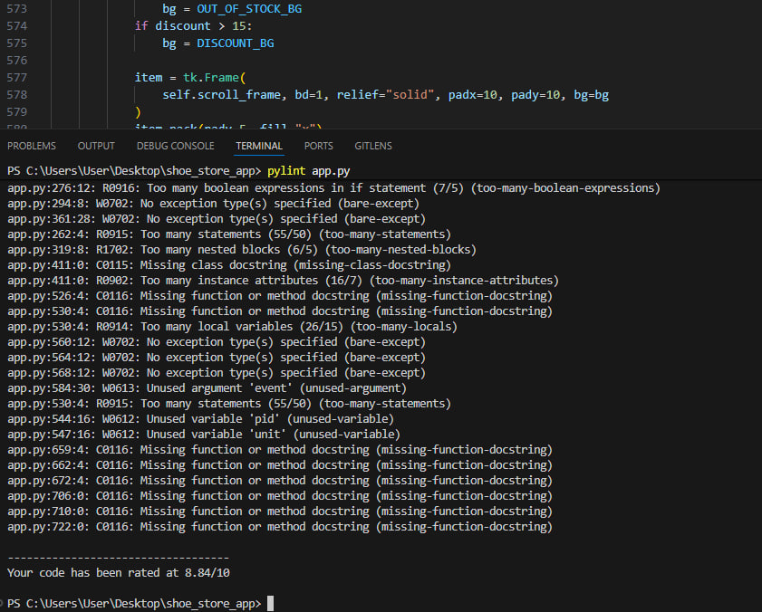

Анализ качества кода

В данном проекте используются инструменты для анализа качества кода:

- flake8 — линтер для проверки Python-кода
- CodeClimate — сервис для анализа поддерживаемости кода

Код проекта был отрефакторен для улучшения читаемости и структуры программы.

# Shoe Store Management System

Программа для управления товарами обувного магазина.

## Функции программы

- Авторизация пользователя
- Просмотр товаров
- Поиск товаров
- Фильтрация по поставщику
- Сортировка по количеству товара
- Добавление, редактирование и удаление товаров
- Работа с изображениями
- Расчёт цены со скидкой

## Code Quality (Linter)

Код был проверен с помощью **Pylint**.

Результат проверки:

## Структура проекта

app.py  
db_setup.py  
import_data.py  
schema.sql  
resources/  
import/

## Запуск программы

Установить зависимости:

pip install -r requirements.txt

Запустить программу:

python app.py

## Работа с заказами (Модуль 4)

Реализован функционал управления заказами:

- Просмотр списка заказов
- Добавление нового заказа
- Редактирование заказа
- Удаление заказа
- Хранение данных в базе данных SQLite
